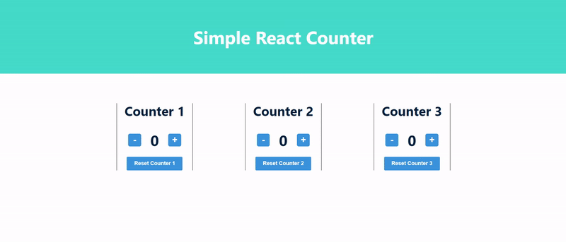
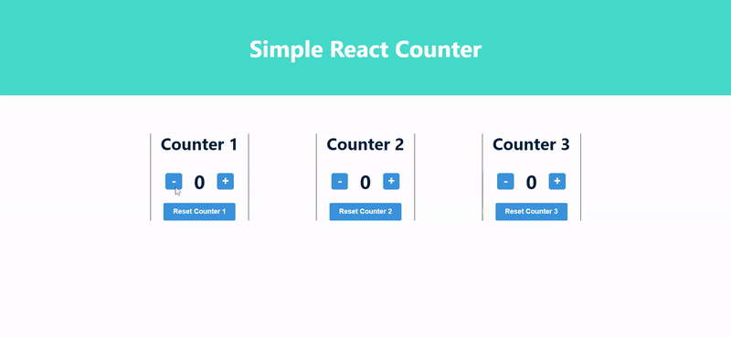

# Simple React Counter

<div style="display:flex;justify-content:center;width:100%;">
  
</div>
<br>

## Live Demo

**[Live Demo of Simple React Counter on GitHub Pages](https://abuna1985.github.io/simple-react-counter/)**

## Setup

Change directories (cd) to this folder(repo) within your terminal and run the following commands:

```shell
npm install
npm start
```

The browser should open at `http://localhost:3000`

## Notable Features

### 1. Decrement and Reset Button Are Disabled When State is 0

<div style="display:flex;justify-content:center;width:100%;">
  
</div>
<br>

#### Initial Code For Buttons

```js
const Button = (props) => (
  <button onClick={props.handleClick}>
    {props.text}
  </button>
)

const App = () => {
  const [value, setValue] = useState(10)

  const setToValue = newValue => {
    setValue(newValue)
  }

  // Do not define components inside another component
  const Display = props => <div>{props.value}</div>
  return (
    <div>
      <Display value={value} />
      <Button handleClick={() => setToValue(1000)} text="thousand" />
      <Button handleClick={() => setToValue(0)} text="reset" />
      <Button handleClick={() => setToValue(value + 1)} text="increment" />
    </div>
  )
}
```

#### Solution for Buttons

With a counter, there is no need to drop below 0. So when the state is 0 for any counter, the decrement and reset button should be disabled.

```js
// ./components/Button/index.js
import React from 'react'
import styles from './Button.module.css'; 

const Button = ({handleClick, children, type, testId, isDisabled }) => {
   return  (
    <button 
      data-testid={testId} 
      onClick={handleClick} 
      className={`${styles.btn} ${type === "reset" ? styles.reset : styles.counter}`} 
      disabled={isDisabled}
    >
      <span>{children}</span>
    </button>;
   );
}

export default Button;
```

A prop called `isDisabled` was added within the `<Button>` component. The value will be a boolean and will show/hide the `disabled` attribute within the HTML `<button>` element. `disabled` would only show if the condition was `true`. 

```js
// ./App.js
...
import Button from './components/Button';
...

function App() {
  const [counterOne, setCounterOne] = useState(0);
  // ...
  return(
   ...
    <div className={styles.body}>
      <Button 
        testId="counter-one-button-down" 
        isDisabled={!counterOne} 
        handleClick={() => decrementCounter(setCounterOne, counterOne)}
      >
        -
      </Button>
      ...
    </div>
    <Button 
      type="reset" 
      testId="counter-one-zero-button" 
      isDisabled={!counterOne} 
      handleClick={() => setCounterToZero(setCounterOne)}
    >
      Reset Counter 1
    </Button>
  );
}
```

We pass `!counterOne` which will be true if the value is 0 (converts to false) to the `isDisabled` prop within the `<Button>` component. Now the decrement and reset will only be available when the counter is not 0.

### 2. <App> Only Depends On 3 Functions For Handling Click Events

#### Initial Code for Helper Functions

```js
const Button = ({ onClick, text }) => (  <button onClick={onClick}>    {text}  </button>)
const App = () => {
  const [left, setLeft] = useState(0)
  const [right, setRight] = useState(0)

  const handleLeftClick = () => {
    setAll(allClicks.concat('L'))
    setLeft(left + 1)
  }

  const handleRightClick = () => {
    setAll(allClicks.concat('R'))
    setRight(right + 1)
  }

  return (
    <div>
      {left}
      <Button onClick={handleLeftClick} text='left' />     
      <Button onClick={handleRightClick} text='right' />      
      {right}
    </div>
  )
}
```

#### Solution for Helper Functions

The thought of creating 6 increment/decrement functions for 3 counters (`incrementCounterOne`, `decrementCounterOne`, `incrementCounterTwo`, etc.) felt unnecessary. A better idea was to make one function that incremented by 1, decremented by 1, and sets the counter to 0. When the counter action is clicked, we pass the update state function and the count of the current counter and run the update. The component tied to the state will also re-render with the new state.

```js
...
import Button from './components/Button';
import Display from './components/Display';
...

function App() {
  const [counterOne, setCounterOne] = useState(0);
  const [counterTwo, setCounterTwo] = useState(0);
  const [counterThree, setCounterThree] = useState(0);

  // pass the function you want to run and the current state of the counter
  // Pass the state update function and current count for that counter, add 1 to counter
  const incrementCounter = (func, counter) => func(counter + 1);
  // Pass the state update function and current count for that counter, subtract 1 from the counter
  const decrementCounter = (func, counter) => func(counter - 1);
  // Pass the state update function, set it to zero
  const setCounterToZero = (func) => func(0);


  return (
    ...
    <div className={styles.counter}>
      <Title type="h2" text="Counter 1" />
      <div className={styles.body}>
        {/* This will run `setCounterOne(counterOne - 1)`*/}
        <Button 
          testId="counter-one-button-down" 
          isDisabled={!counterOne} 
          handleClick={() => decrementCounter(setCounterOne, counterOne)}
        >
          -
        </Button>
        <Display testId="counter-one" counter={counterOne} />
        {/* This will run `setCounterOne(counterOne + 1)`*/}  
        <Button 
          testId="counter-one-button-up"
          handleClick={() => incrementCounter(setCounterOne, counterOne)}
        >
          +
        </Button>
      </div>
      {/* This will run `setCounterOne(0)`*/} 
      <Button 
        type="reset" 
        testId="counter-one-zero-button" 
        isDisabled={!counterOne} 
        handleClick={() => setCounterToZero(setCounterOne)}
      >
        Reset Counter 1
      </Button>
    </div>
    ...
```

Now the functions are reusable and they don't care about the counter state. If I wanted to make a 4th counter, all I need to do is initiate state for a 4th counter and add the JSX (`<Title>`, `<Display>` `<Buttons>`). Now I see the benefit of reuseable components.

## Requirements

[x] Apply `props` in the components to make them more customizable.

[x] Apply `useState` to 3 separate counters.

[x] Use a organized structure for `components` in the React application.

[x] Have 3 separate counters that work independently of each other.

[x] The decrement button and reset button should be disabled when state is 0.

[x] Use the concept of lifting state to keep most of the logic in the <App> component.

[x] Write 5-6 unit tests with `react-testing-library` that show the functionality is successful.

[x] Incorporate CSS modules in the React application.


## Purpose Of This Project

After completing the reading and exercises for [Part 1 of the Full Stack Open Course](https://fullstackopen.com/en/part1), all of the content made sense to a point. So I decided to do two things to solidify my knowledge:

1. Took notes and documented best-practices that would be a helpful reference in the future for myself or other people learning React. [The notes for part 1 can be found here](https://github.com/abuna1985/full-stack-open-course/tree/main/notes). 
2. Built a project with the knowledge gained and best-practices applied from the Part 1 articles.

Using the examples from the articles in Part 1, I created a React application with 3 separate counters within the `<App>` component state. I used `props` to customize the `<Title>`, `<Button>`, and `<Display>` components. I used state hooks to update the 3 counters separately. All the state and function logic would remain in the <App> component and the other components would be given data and rendered without worrying about where the count is.

In order to make this project a little more challenging, I created unit tests with `React Testing Library` and scoped styling with CSS modules. 

## Testing

Here is the pseudo-code for what my unit test are running

### Should Have Internal State Equal To 0

1. Render `<App>`
2. Look for element with `data-testid` of `counter-one`, `counter-two`, `counter-three`  and confirm `textContent` is 0.

### Should Have Increment Button That Is Enabled

1. Render `<App>`
2. Look for element with `data-testid` of `counter-one-button-up`, `counter-two-button-up`, `counter-three-button-up` and confirm `disabled` is **not** an attribute on the element.

### Should Have Decrement Button That Is Disabled

1. Render `<App>`
2. Look for element with `data-testid` of `counter-one-button-down`, `counter-two-button-down`, `counter-three-button-down` and confirm `disabled` is an attribute that exist on these elements.
### Increments Counter

1. Render `<App>`
2. Look for element with `data-testid` of `counter-one-button-up`, `counter-two-button-up`, `counter-three-button-up` and fire a click event.
3. Look for element with `data-testid` of `counter-one`, `counter-two`, `counter-three` and confirm textContent is 1.


### Decrements Counter

1. Look for element with `data-testid` of `counter-one-button-up`, `counter-two-button-up`, `counter-three-button-up` and fire a click event.
2. Look for element with `data-testid` of `counter-one-button-down`, `counter-two-button-down`, `counter-three-button-down` and fire a click event.
3. Look for element with `data-testid` of `counter-one`, `counter-two`, `counter-three` and confirm textContent is 0.

### Resets Counter
1. Look for element with `data-testid` of `counter-one-button-up`, `counter-two-button-up`, `counter-three-button-up` and fire a click event.
2. Look for element with `data-testid` of `counter-one-button-up`, `counter-two-button-up`, `counter-three-button-up` and fire a click event again.
3. Look for element with `data-testid` of `counter-one`, `counter-two`, `counter-three` and confirm textContent is 2.
4. Look for element with `data-testid` of `counter-one-reset-button`, `counter-two-reset-button`, `counter-three-reset-button` and fire a click event.
5. Look for element with `data-testid` of `counter-one`, `counter-two`, `counter-three` and confirm textContent is 0.
## Available Scripts

In the project directory, you can run:

### `npm start`

Runs the app in the development mode.\
Open [http://localhost:3000](http://localhost:3000) to view it in the browser.

The page will reload if you make edits.\
You will also see any lint errors in the console.

### `npm run test`

Launches the test runner in the interactive watch mode.\
See the section about [running tests](https://facebook.github.io/create-react-app/docs/running-tests) for more information.

### `npm run build` or `npm run predeloy`

Builds the app for production to the `build` folder.\
It correctly bundles React in production mode and optimizes the build for the best performance.

The build is minified and the filenames include the hashes.\
Your app is ready to be deployed!

See the section about [deployment](https://facebook.github.io/create-react-app/docs/deployment) for more information.

### `npm run deploy`

Your repo will activate GitHub pages for the repo, create a `gh-pages`, and point the GitHub Pages to the `gh-pages` branch. It will then build an app for production and dump the production files/folders into the `gh-pages` branch.

***Note**: If you fork this repo and wish to run this command, please change the `homepage` property within `package.json` to fit your Github Pages link. It will be something like `https://{username}.github.io/simple-react-counter`.

### `npm run eject`

**Note: this is a one-way operation. Once you `eject`, you can’t go back!**

If you aren’t satisfied with the build tool and configuration choices, you can `eject` at any time. This command will remove the single build dependency from your project.

Instead, it will copy all the configuration files and the transitive dependencies (webpack, Babel, ESLint, etc) right into your project so you have full control over them. All of the commands except `eject` will still work, but they will point to the copied scripts so you can tweak them. At this point you’re on your own.

You don’t have to ever use `eject`. The curated feature set is suitable for small and middle deployments, and you shouldn’t feel obligated to use this feature. However we understand that this tool wouldn’t be useful if you couldn’t customize it when you are ready for it.

## Technologies Used

This project was created with:

- [Create React App](https://create-react-app.dev/docs/getting-started)
- [React Testing Library (included with create-react-app)](https://testing-library.com/docs/react-testing-library/intro/)
- [CSS modules](https://github.com/css-modules/css-modules)
- [gh-pages](https://create-react-app.dev/docs/deployment#github-pages)


